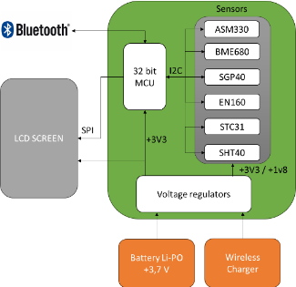
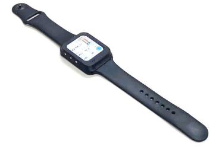

# OpenSmell

> Building open infrastructure for digital olfaction.

Technological progress is the externalisation of human capability. We modelled our innate faculties into reproducible systems: fire externalised digestion, writing externalised memory, the camera externalised vision, and the microphone externalised hearing. We didn't just digitise our biology; we transcended it. Today we can see a single atom and hear the echo of the Big Bang.

But our chemical sense remains trapped in biology—subjective, unshareable, and unprogrammable. OpenSmell is building open infrastructure to digitise smell through open hardware, open protocols, and open data.

---

## The Challenge

Digitising smell is a problem of high dimensionality. The human olfactory system uses roughly 400 receptor types, creating a combinatorial explosion of signals with no simple compression like wavelength or frequency. 

But a complete predictive theory of olfaction isn't required to build the infrastructure. We just need a stable, measurable, device-invariant representation. That is what OpenSmell provides.

📄 **Technical Framework towards Interoperability:** [Zenodo Record 20818935](https://zenodo.org/records/20818935)

---

## OpenSmell Provides

**Open Hardware**
A reference e-nose design using cheap off-the-shelf components (ESP32 + MOX array). No custom PCB milling or electronics master-craft knowledge required. Just connect everything till you see lights :D.
→ [`electronic-nose/`](https://github.com/opensmell/electronic-nose)

**Open Software**
**[`Osmograph`](https://github.com/opensmell/osmograph)** is a zero‑code GUI for builders: it enforces the standard recording protocol, validates signal quality, trains substance classifiers with button clicks, flashes firmware the moment you plug in your device, and displays live sensor traces—no electronics background or coding required. For developers, we provide a Python SDK (`pip install opensmell`) to extract framework features and build custom pipelines.

**Open Protocol**
A standardised recording procedure that makes temporal features reproducible across different users and devices.

**Open Data**
A community-contributed Data Commons for training shared, device-invariant representations.

---

## What You Can Build

- Gas leak alarms — Detect LPG, methane, CO with threshold-based alerts
- Food & agriculture — Track fruit ripening, detect spoilage in refrigerators, coffee roast profiling, honey/spice authenticity etc.
- Substance classifiers — Identify coffee varieties, detect adulteration, fermentation monitors, etc.
- Breath analysis — Track ketosis (acetone), digestive health markers
- Environmental monitoring — Map urban air quality, detect industrial odours
See more ideas in the discord.

**Currently Out of Reach**:
- Isomer discrimination — MOX sensors respond to redox chemistry, not molecular structure
- Absolute ppm without calibration — Requires per-device calibration against known standards
- Complex mixture decomposition — Cannot separate individual components from mixed headspaces
- Chirality (L- vs D-forms) — Cannot distinguish enantiomers

These are fundamental chemical limits of MOX sensors. Next-generation sensors (optical, electrochemical, mass spectrometry) will be required to cross these boundaries.

___
## Some Inspiration

**Wearable Odour Monitoring**
A portable Sniffing Smartwatch that can detect low concentrations of VOCs.

 
*University of Extremadura, [paper](https://www.cetjournal.it/cet/24/112/017.pdf)*

**Food & Beverage Quality Control**
MOX sensor arrays deployed for wine aroma profiling, monitoring beer fermentation in real-time, and tracking fruit ripening by detecting specific VOCs emitted during maturation.

**Large-Scale Smell Datasets**
SmellNet provides 50-substance multi-session recordings with cross-modal alignment to GC-MS elemental composition for learned representations of smell.

*MIT Media Lab: [GitHub](https://github.com/MIT-MI/SmellNet)*

**Industrial Safety & Quality**
Electronic noses for batch consistency monitoring, detecting off-odours in production lines, and drift-aware anomaly detection in food processing facilities.

**Environmental Odour Mapping**
Portable e-noses mapping urban odour pollution and industrial emissions through crowdsourced data collection.

and so on.

---

## Get Started in 10 Minutes

**Builders**
Order the parts, follow the wiring guide in `electronic-nose/BUILD.md`, and use Osmograph to flash the firmware with one click. Total time: 45 minutes to assemble, 5 minutes to first recording.

**Developers**
`pip install opensmell`, extract the 145-dimensional framework features, and train your first classifier. 

**Researchers**
Read the preprint, reproduce the canonical experiments, and contribute to the Data Commons.

---

## The Interoperability Challenge

We proved mathematically: $R_s/R_0$ normalization completely cancels hardware constants like supply voltage and load resistance. Now we need to prove it physically. Build a device, record a standard substance, and upload the CSV to the Data Commons. Help us validate the framework across independent hardware.

Interoperability allows you to take other people's classifiers, like a breathalyser app, and run it on your own hardware without training.

---

## Research Directions & The Road Ahead

**Next-Generation Sensors (Gen 2–5)**
MOX sensors are excellent for pattern recognition but have fundamental chemical limits. The roadmap includes integrating electrochemical, optical (IR/Raman), chiral, and miniaturised mass spectrometry sensors to achieve absolute quantification, isomer discrimination, and molecular identification.

**Federated Learning**
Scaling a device-invariant latent space without centralising raw data, preserving privacy and bandwidth.

**Multi-modal Models**
Bridging chemical structure, sensor streams, and semantic descriptors to build comprehensive foundation models for olfaction.

---

## Join the Community

OpenSmell is a community endeavour. We need builders, developers, researchers, and domain experts. Join the Discord to get started, grab a good first issue, or just come critique the designs.

**Donate USDC on Polygon:** `0x699d0178f16484509f57d4d77f310b6b617621ce`

---

In 1975, a Kodak engineer built the first digital camera. It was the size of a toaster, weighed eight pounds, and recorded a 0.01-megapixel image onto a cassette tape. His colleagues probably asked, "Why would anyone want to look at pictures on a television?"

Today, more than 80 trillion photos are taken every year. The same transformation will happen to smell. It will start with clunky devices, hobbyist data, and failed experiments. Then it will be everywhere.
